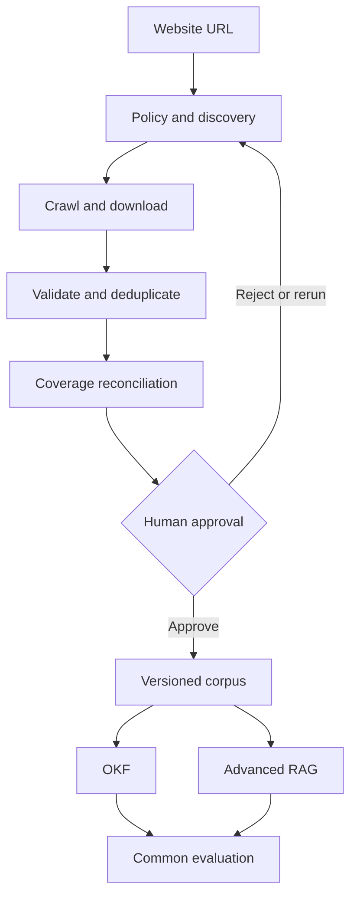

# OKF: Auditable Web Knowledge Extraction

OKF is a research and engineering project for discovering documents on public websites, proving crawl coverage, freezing an approved corpus, and comparing two knowledge-access approaches over the same evidence:

1. an Open Knowledge Format (OKF) representation; and
2. an advanced retrieval-augmented generation (RAG) pipeline.

The first pilots are:

- [AISATS](https://www.aisats.in/) — initial controlled pilot
- [Kolte Patil](https://www.koltepatil.com/) — generalisation and complex-site pilot

Only archives exposed within each website are in scope. External historical archives, authenticated content, and bypassing access controls are out of scope unless a later approved decision changes that boundary.

## Delivery principle

No document may enter OKF or RAG until the discovery run has produced a reviewable inventory, every discovered URL has a terminal status, exceptions are visible, and a user has approved a versioned corpus.



## Current status

Milestone M0 is approved. M1 is implementing the fixture-tested discovery core before the controlled AISATS pilot. The first increment covers URL policy, static discovery, bounded retrieval, PDF validation, exact duplicate evidence, terminal inventory, and a LangGraph reconciliation wrapper. See [the M1 scope and execution sequence](docs/m1-aisats-discovery.md).

M1 Increment 2 adds robots enforcement, retry evidence, recursive sitemaps, atomic resume checkpoints, and two-run convergence measurement. The controlled live procedure is documented in the [AISATS pilot runbook](docs/aisats-pilot-runbook.md).

M2 Increment 1 adds the local validation UI: crawl configuration, live progress, document and exception inspection, independent-run convergence, evidence download, and a persisted human corpus-approval manifest. See the [validation UI guide](docs/validation-ui.md).

M2 Increment 2 separates repeat-run stability from adversarial QA, combines deterministic HTTP/sitemap discovery with Playwright-rendered discovery, and adds mandatory typed, content-addressed raw corpus storage. See [Discovery, adversarial QA and corpus storage](docs/crawler-qa-and-corpus-storage.md).

Stage 2 Increment 1 adds audited human acceptance for bounded QA coverage gaps, freezes a hash-verified corpus snapshot, and creates deterministic typed extraction records with page/span provenance. See [Stage 2 plan](docs/stage-2-plan.md).

M5–M7 now have an executable local baseline: a versioned OKF 1.0 bundle, an independent hybrid parent–child RAG index, side-by-side grounded querying, and a common evaluation API. Both pipelines consume the same immutable Stage 2 records. See [OKF and RAG implementation](docs/okf-rag-implementation.md).

## Run the validation UI

Python 3.12 is required. From the repository root:

```bash
python3.12 -m venv .venv
source .venv/bin/activate
python -m pip install -e ".[dev]"
playwright install chromium
okf-ui
```

Open [http://127.0.0.1:8000](http://127.0.0.1:8000). Crawl evidence and approvals are stored under `.okf-data/` and intentionally excluded from Git. Do not approve a corpus merely because a run completed; use the UI's two-run and manual reconciliation gates.

## Repository map

```text
docs/
  architecture.md
  okf-definition.md
  project-charter.md
  stage-1-backlog.md
  stage-1-plan.md
  decisions/
schemas/
  okf-1.0.schema.json
src/okf_platform/
  static/
tests/
```

## Milestones

| Milestone | Outcome | Exit gate |
|---|---|---|
| M0 Foundation | Scope, architecture, decisions and backlog | Foundation approved |
| M1 AISATS discovery | Auditable document inventory | Coverage evidence accepted |
| M2 Crawl UI | Live run, inventory and approval screens | User workflow accepted |
| M3 Kolte Patil validation | Complex-site generalisation | Site adapter rules documented |
| M4 Canonical corpus | Versioning, parsing, OCR and provenance | Corpus v1 approved |
| M5 OKF | Structured knowledge and query path | Local baseline implemented; pilot acceptance pending |
| M6 Advanced RAG | Hybrid retrieval, reranking and citations | Local baseline implemented; model adapter pending |
| M7 Evaluation | Reproducible OKF-versus-RAG comparison | Common API implemented; gold set pending |
| M8 Hardening | Security, scale and release readiness | Release criteria pass |

## Working agreements

- GitHub is the source of truth for requirements, decisions, code, tests and evidence.
- Changes are developed on feature branches and reviewed through pull requests.
- Architecture changes are captured as Architecture Decision Records (ADRs).
- Corpus, model, prompt and evaluation versions must be reproducible.
- Public crawl policy, robots directives, rate limits and site terms must be respected.

See [the project charter](docs/project-charter.md), [architecture](docs/architecture.md), [Stage 1 plan](docs/stage-1-plan.md), and [Stage 1 backlog](docs/stage-1-backlog.md).
