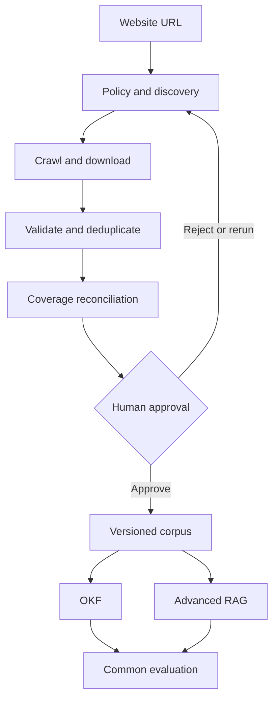

# OKF: Auditable Web Knowledge Extraction

OKF is a research and engineering project for discovering documents on public websites, proving crawl coverage, freezing an approved corpus, and comparing two knowledge-access approaches over the same evidence:

1. an Open Knowledge Format (OKF) representation; and
2. an advanced retrieval-augmented generation (RAG) pipeline.

The first pilots are:

- [AISATS](https://www.aisats.in/) — initial controlled pilot
- [Kolte Patil](https://www.koltepatil.com/) — generalisation and complex-site pilot

Only archives exposed within each website are in scope. External historical archives, authenticated content, and bypassing access controls are out of scope unless a later approved decision changes that boundary.

## Delivery principle

No document may enter OKF or RAG until the discovery run has produced a reviewable inventory, every discovered URL has a terminal status, exceptions are visible, and a user has approved a versioned corpus.



## Current status

Milestone M0 defines the charter, target architecture, Stage 1 plan, backlog, decisions, and initial Python package structure. Crawler implementation begins only after this foundation is reviewed.

## Repository map

```text
docs/
  architecture.md
  okf-definition.md
  project-charter.md
  stage-1-backlog.md
  stage-1-plan.md
  decisions/
src/okf_platform/
tests/
```

## Milestones

| Milestone | Outcome | Exit gate |
|---|---|---|
| M0 Foundation | Scope, architecture, decisions and backlog | Foundation approved |
| M1 AISATS discovery | Auditable document inventory | Coverage evidence accepted |
| M2 Crawl UI | Live run, inventory and approval screens | User workflow accepted |
| M3 Kolte Patil validation | Complex-site generalisation | Site adapter rules documented |
| M4 Canonical corpus | Versioning, parsing, OCR and provenance | Corpus v1 approved |
| M5 OKF | Structured knowledge and query path | OKF acceptance suite passes |
| M6 Advanced RAG | Hybrid retrieval, reranking and citations | RAG acceptance suite passes |
| M7 Evaluation | Reproducible OKF-versus-RAG comparison | Results reviewed |
| M8 Hardening | Security, scale and release readiness | Release criteria pass |

## Working agreements

- GitHub is the source of truth for requirements, decisions, code, tests and evidence.
- Changes are developed on feature branches and reviewed through pull requests.
- Architecture changes are captured as Architecture Decision Records (ADRs).
- Corpus, model, prompt and evaluation versions must be reproducible.
- Public crawl policy, robots directives, rate limits and site terms must be respected.

See [the project charter](docs/project-charter.md), [architecture](docs/architecture.md), [Stage 1 plan](docs/stage-1-plan.md), and [Stage 1 backlog](docs/stage-1-backlog.md).
