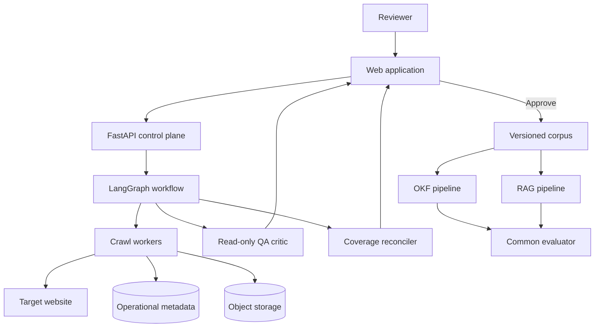
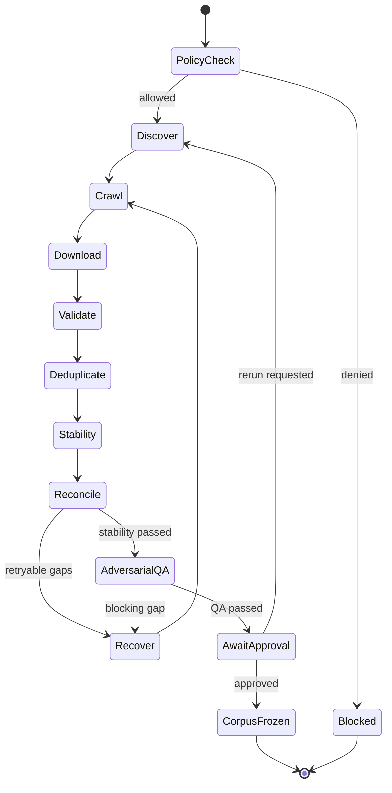

# Target Architecture

## Architectural intent

The platform separates deterministic crawl mechanics from agentic orchestration. LangGraph manages state, routing, retries and human approval; specialised libraries perform HTTP retrieval, browser rendering, parsing, hashing and persistence.

## Context

## Stage 1 workflow

## Bounded graph nodes

| Node | Responsibility | Deterministic boundary |
|---|---|---|
| Policy | Resolve allowed hosts, robots directives, rates and exclusions | Cannot override policy |
| Discovery | Seed from sitemap, navigation, internal archives and configured entry points | Emits normalised URLs only |
| Crawler | Fetch static pages and extract links | Host/depth/budget enforced |
| Browser | Independently render DOM and observe same-domain network assets | Same robots, host and resource policy boundary |
| Downloader | Persist qualifying raw assets and record response/provenance | Content-type and size rules enforced |
| Validator | Check signature, parseability, truncation indicators, size and hash | No semantic approval |
| Deduplicator | Group exact and near duplicates | Never deletes source evidence |
| Reconciler | Compare expected, discovered, processed and failed sets | Produces gaps, not guesses |
| Recovery | Retry transient failures with bounded backoff | Cannot retry indefinitely |
| Approval | Pause for reviewer decision | No automatic approval |
| QA critic | Read-only browser-first challenge and severity verdict | Cannot write corpus, alter baseline or approve |

## Proposed technology baseline

| Layer | Baseline | Decision status |
|---|---|---|
| API | Python 3.12 + FastAPI | Proposed |
| Workflow | LangGraph | Confirmed direction |
| Static crawl | Bounded HTTP/sitemap crawler with deterministic HTML parsing | Implemented |
| Dynamic crawl | Playwright rendered-DOM and network discovery | Implemented |
| PDF validation/parsing | PyMuPDF and pdfplumber | Spike required |
| OCR | Pluggable OCR adapter | Selection deferred |
| Frontend | React/Next.js | Proposed |
| Live events | Server-Sent Events first; WebSocket if bidirectional need emerges | Proposed |
| Metadata | SQLite locally; PostgreSQL deployment adapter | Local implemented; production adapter pending |
| Raw files/corpus | Content-addressed filesystem locally; S3/MinIO deployment adapter | Local implemented; production adapter pending |
| Vector retrieval | Pluggable; Qdrant or pgvector candidate | Deferred to RAG ADR |
| Evaluation | Deterministic metrics plus configurable research evaluators | Deferred |

## Core data model

| Entity | Key fields |
|---|---|
| CrawlRun | run ID, target, policy snapshot, status, timestamps, counters |
| UrlRecord | canonical URL, referring URL, discovery method, depth, terminal status |
| FetchAttempt | request metadata, response metadata, timing, retry class, error |
| Asset | asset type, source/final URL, MIME evidence, bytes, SHA-256, storage URI, tool and referrer |
| DocumentVersion | logical document, content hash, retrieval time, predecessor |
| DuplicateGroup | exact/near type, members, similarity evidence, retained canonical |
| CoverageEvidence | discovery surface, expected set, observed set, gaps, run |
| CorpusSnapshot | immutable version, included documents, exclusions, approval record |
| ApprovalDecision | reviewer, decision, timestamp, comments, evidence snapshot |

## URL and document states

Each discovered URL must reach exactly one terminal outcome:

- `page_processed`
- `downloaded_valid`
- `downloaded_invalid`
- `not_a_document`
- `excluded_by_policy`
- `duplicate_exact`
- `duplicate_near_review`
- `not_found`
- `access_denied`
- `permanent_error`
- `unresolved_after_retries`

Transient states such as `queued`, `fetching`, `retry_wait` and `validating` cannot remain when a run is offered for approval.

## Completeness model

Completeness is an evidence bundle rather than a single percentage. It includes:

1. sitemap reconciliation;
2. internal-link frontier exhaustion;
3. archive/category/year/pagination traversal evidence;
4. document-link versus download reconciliation;
5. bounded retry and failure classification;
6. repeat-run convergence with no new qualifying URLs;
7. a separate adversarial QA report from alternate discovery evidence; and
8. counts and exceptions by discovery surface and asset type.

The UI may display a readiness status only when mandatory controls pass. A reviewer must still approve the corpus.

## Security and operational controls

- Validate and normalise submitted URLs; block private/link-local destinations and unsafe redirects.
- Enforce allowed domains, DNS/IP checks, MIME allowlists and download-size limits.
- Rate-limit per host and bound crawl depth, pages, duration and concurrency.
- Store raw files as immutable objects; scan before downstream processing.
- Escape untrusted content in the UI and treat document text as data, not instructions.
- Record append-only audit events for policy decisions, exclusions and approval.
- Support pause, resume, cancellation and idempotent retry.

## Later-stage isolation

The approved corpus is a contract. OKF and RAG may generate independent derivatives, but neither may modify the frozen raw corpus. Comparative evaluation records corpus version, pipeline version, model/configuration version and evaluation-set version for every run.
